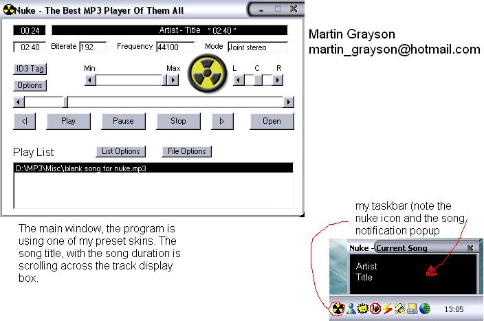



## Nuke MP3 Player

### Description

Its an MP3 Player that uses the windows media player control, loads of features including:

~Skinnable

~Will read ID3v1 Tags

~User can find out bitrate, frequency and if a file is stereo or mono

~Runs in the system tray

~Balance controls

~Volume controls

~Save/open playlists

~Add whole directory/single files to playlists

~Drag drop files into playlist

~Tells you the length of a mp3 file, and how long its played it for

~Displays song name

~Seeking bar

~will popup little (msn style) windows from task bar on new song, telling you the song title

~Repeat one, all, random, or normal play modes

~Can change text colour

~Can be set to be always on top

~Playlists can be cleared/files can be removed

~Can control playback from tray

~Detects if a soundcard is present
 
### More Info
 
A mp3 file

It plays the file, gets the id3 tag of it, quality etc. im running short on time here!

some times it does not close well, have to do alt+ctrl+del

             |
---                |---
**Submitted On**   |2002-08-13 13:14:32
**By**             |[Martin Grayson](https://github.com/Planet-Source-Code/PSCIndex/blob/master/ByAuthor/martin-grayson.md)
**Level**          |Intermediate
**User Rating**    |4.7 (28 globes from 6 users)
**Compatibility**  |VB 6\.0
**Category**       |[Sound/MP3](https://github.com/Planet-Source-Code/PSCIndex/blob/master/ByCategory/sound-mp3__1-45.md)
**World**          |[Visual Basic](https://github.com/Planet-Source-Code/PSCIndex/blob/master/ByWorld/visual-basic.md)
**Archive File**   |[Nuke\_MP3\_P1174878132002\.zip](https://github.com/Planet-Source-Code/martin-grayson-nuke-mp3-player__1-37911/archive/master.zip)

